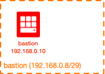
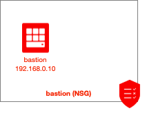
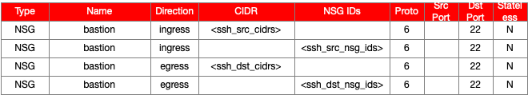

# Oracle Cloud Infrastructure Bastion Terraform Module

## Introduction

This module provides a way to easily and quickly build a bastion (jump box) (and the related config options) in Oracle Cloud Infrastructure (OCI).

## Solution

Bastions are a common component in many environments.  This module provides the ability to create the following resources:

| Resource | Created by Default? |
|---|---|
| Compute Instance | Yes |
| Subnet | Yes |
| NSG | Yes |
| NSG rules | Yes |

## Diagrams

### Topology
Here's a quick snapshot into the default topology created by this module:



### Security Policy
Here are the NSG(s) created by this module (by default):



Here's the default security policy that is created by this module:



### Resource-specific inputs

#### Module

| Attribute | Data Type | Required | Default Value | Valid Values | Description |
|---|---|---|---|---|---|
| default\_compartment\_id | string | yes | none | string of the compartment OCID | This is the default OCID that will be used when creating objects (unless overridden for any specific object).  This needs to be the OCID of a pre-existing compartment (it will not create the compartment. |
| vcn\_id | string | yes | none | string of the VCN OCID | The OCID of the VCN that is to be used must be provided here. |
| vcn\_cidr | string | yes | none | string of the VCN CIDR | The CIDR of the VCN that is to be used must be provided here. |
| default\_defined\_tags | map(string) | no | {} | Any map of tag names and values that is acceptable to the OCI API. | If any Defined Tags are set here, unless overwritten at the resource level, will be applied to all resources created by this module. |
| default\_freeform\_tags | map(string) | no | {} | Any map of tag names and values that is acceptable to the OCI API. | If any Freeform Tags are set here, unless overwritten at the resource level, will be applied to all resources created by this module. |
| default\_ssh\_auth\_keys | list(string) | no | [] | Any list of public (authorized) SSH keys. | The different authorized keys that are used (unless otherwise indicated on compute instances). |
| default\_img\_id | string | no | null | OCID of compute instance image. | If this is provided, it can be used as the default image OCID for resources created (unless otherwise specified at the resource level). |
| default\_img\_name | string | no | null | Name of compute instance image. | If this is provided, it can be used as the default image to be used for resources created (unless otherwise specified at the resource level).  The name can be obtained from https://docs.cloud.oracle.com/iaas/images/.  By providing a name (rather than an OCID), the module looks up the OCID (by the name) automatically. |
| create\_subnet | bool | no | true | true or false | Whether or not a subnet should be created for the bastion. |
| existing\_subnet\_id | string | no | none | OCID of an existing subnet to use | The OCID of the subnet where the bastion should be placed. |
| subnet\_options | see below | no | see below | see below | Parameters for customizing the subnet that is created (if create\_subnet is true). |
| create\_nsg | bool | no | true | true or false | Whether or not a new NSG should be created for the bastion. |
| existing\_nsg\_id | string | no | none | OCID of an existing NSG to use | The OCID of the NSG where new rules (specific for the bastion requirements) should be placed. |
| nsg\_options | see below | no | see below | see below | Parameters for customizing the NSG that is created (if create\_nsg is true). |
| nsg\_ids\_to\_associate | list(string) | no | none | OCID of existing NSG(s) | If there are additional NSGs which should be associated to the compute instance(s), provide them here. |
| ssh\_src\_cidrs | list(string) | no | none | List of strings of CIDR(s) | Specify the CIDRs that should be allowed to SSH into the compute instance(s).  This effectively manages the ingress rules created that allow SSH into the bastion NSG. |
| ssh\_dst\_cidrs | list(string) | no | none | List of strings of CIDR(s) | Specify the CIDRs that the bastion should be allowed access via SSH.  This effectively manages the egress rules created that allow SSH from the bastion NSG to other CIDRs. |
| ssh\_src\_nsg\_ids | list(string) | no | none | List of strings of NSG OCID(s) | Specify the NSG OCIDs that should be allowed to SSH into the compute instance(s).  This effectively manages the ingress rules created that allow SSH into the bastion NSG. |
| ssh\_dst\_nsg\_ids | list(string) | no | none | List of strings of NSG OCID(s) | Specify the NSG OCIDs that the bastion should be allowed access via SSH.  This effectively manages the egress rules created that allow SSH from the bastion NSG to other NSGs. |
| create\_compute | bool | no | true | true or false | Whether or not a new compute instance for the bastion. |
| compute\_options | see below | no | see below | see below | Parameters for customizing the compute instance(s) that is created (if create\_compute is true). |

##### subnet_options

The `subnet_options` attribute is an optional map attribute.  Note that if this attribute is used, all keys/values must be specified (Terraform does not allow for default or optional map keys/values).  It has the following defined keys (and default values):

| Key | Data Type | Default Value | Valid Values | Description |
|---|---|---|---|---|
| name | string | "bastion" | Any name acceptable to the OCI API. | Used to define a specific name for the subnet. |
| compartment\_id | string | null | Compartment OCID | Pre-existing compartment OCID (if default compartment is not to be used).  If this value is null, the default compartment OCID will be used. |
| defined\_tags | map(string) | {} | Any map of tag names and values that is acceptable to the OCI API. | If any Defined Tags should be set on this resource, do so with this attribute.  If not specified, the default\_defined\_tags value will be used. |
| freeform\_tags | map(string) | {} | Any map of tag names and values that is acceptable to the OCI API. | If any Freeform Tags should be set on this resource, do so with this attribute.  If not specified, the default\_freeform\_tags value will be used. |
| cidr | string | "192.168.0.8/29" | IPv4 CIDR | Specify the IPv4 CIDR to be used for the Subnet.  If dynamic_cidr is true, the CIDR specified here will be used in the subnet calculation.  If dynamic_cidr is false, the CIDR specified here will be the one used by the subnet. |
| cidr\_len | number | none | Any number between 16 and 30 | This is the desired bit length (number of bits in the subnet mask) for the new, dynamically generated subnet CIDR.  Only applicable if dynamic_cidr is true. |
| cidr\_num | number | none | This is the zero-indexed network number that should be used for the subnet.  For example, let's say that cidr is 192.168.0.0/16 and cidr\_len is 24.  For cidr\_num of 1, a dynamically generated CIDR of 192.168.1.0/24 would be given.  In the same scenario, with a cidr\_num of 0, 192.168.0.0/24 would result and cidr\_num of 240 would yield 192.168.240.0/24. |
| enable\_dns | bool | true | Whether or not DNS should be enabled for the subnet. |
| dns\_label | string | "bastion" | Valid DNS name. | Specify the DNS label to be used for the subnet.  If this value is null, a dynamically generated value of *subnet<index_num>* will be used.  For example, the third subnet definition, if DNS is enabled, but no dns_label is provided (a null value is given), a value of *subnet2* will be generated (remembering that index numbers are zero-indexed). |
| private | bool | false | true/false | If set to true, the subnet will be a private subnet.  If set to false, a public subnet will be created.  Many bastions are public, which is why the subnet `private` attribute defaults to true for the bastion module. |
| ad | number | null | null, 0, 1 or 2 (dependent upon the number of available Availability Domains (ADs) in the specific region being used) | If a regional subnet is desired, leave this value as null, otherwise specify the AD number (zero-index, meaning AD1 = 0, AD2 = 1, AD3 = 2) to create an AD-specific subnet. |
| dhcp\_options\_id | string | null | null or OCID | Specify the OCID of the DHCP Options to use for the subnet. |
| route\_table\_id | string | null | null or OCID | Specify the OCID of the Route Table to use for the subnet. |
| security\_list\_ids | list of strings | null | null or list of OCID(s) | Specify the OCID(s) of the Security List(s) to use for the subnet, in list form. |

These options are largely a pass-through for the Subnet core module.

Example:

```
module "bastion" {
  ... /snip - shortened for brevity...

  default_compartment_id  = var.default_compartment_id
  
  subnet_options      = {
    name              = "test"
    compartment_id    = null
    defined_tags      = null
    freeform_tags     = null
    dynamic_cidr      = false
    cidr              = "192.168.0.0/30"
    cidr_len          = null
    cidr_num          = null
    enable_dns        = true
    dns_label         = "test1"
    private           = true
    ad                = null
    dhcp_options_id   = null
    route_table_id    = null
    security_list_ids = null
  }
}
```

The above example will create a private subnet with a name (display name) of *test*, DNS label of *test1*, a CIDR of *192.168..0.0/30*, using the default compartment OCID.

##### nsg_options

The `nsg_options` variable is an optional map attribute.  Note that if this attribute is used, all keys/values must be specified (Terraform does not allow for default or optional map keys/values).  It has the following defined keys (and default values):

| Key | Data Type | Default Value | Valid Values | Description |
|---|---|---|---|---|
| name | string | "bastion" | A name recognized as valid by the OCI API. | This is the name of the NSG that is to be created. |
| compartment\_id | string | null | Compartment OCID | Pre-existing compartment OCID (if default compartment is not to be used).  If this value is null, the default compartment OCID will be used. |
| defined\_tags | map(string) | {} | Any map of tag names and values that is acceptable to the OCI API. | If any Defined Tags should be set on this resource, do so with this attribute.  If not specified, the default\_defined\_tags value will be used. |
| freeform\_tags | map(string) | {} | Any map of tag names and values that is acceptable to the OCI API. | If any Freeform Tags should be set on this resource, do so with this attribute.  If not specified, the default\_freeform\_tags value will be used. |

Example:

```
module "bastion" {
  ... /snip - shortened for brevity...

  default_compartment_id  = var.default_compartment_id
  
  nsg_options         = {
    name              = "awesome_bastion"
    compartment_id    = null
    defined_tags      = null
    freeform_tags     = null
  }
}
```

The above example will create a NSG with a name of `awesome_bastion`, using the default compartment ID and tags (defined and freeform).

##### compute_options

The `compute_options` attribute is an optional map attribute.  Note that if this attribute is used, all keys/values must be specified (Terraform does not allow for default or optional map keys/values).  It has the following defined keys (and default values):

| Key | Data Type | Default Value | Valid Values | Description |
|---|---|---|---|---|
| compartment\_id | string | null | Compartment OCID | Pre-existing compartment OCID (if default compartment is not to be used).  If this value is null, the default compartment OCID will be used. |
| defined\_tags | map(string) | {} | Any map of tag names and values that is acceptable to the OCI API. | If any Defined Tags should be set on this resource, do so with this attribute.  If not specified, the default\_defined\_tags value will be used. |
| freeform\_tags | map(string) | {} | Any map of tag names and values that is acceptable to the OCI API. | If any Freeform Tags should be set on this resource, do so with this attribute.  If not specified, the default\_freeform\_tags value will be used. |
| ad | number | 0 | The zero-indexed number of the desired AD. | Provide a number to indicate the AD you'd like the compute instance deployed to.  The number should be zero-indexed, meaning AD1 = 0, AD2 = 1, AD3 = 2, etc. |
| fd | string | none | A string designating a valid FD. | The Fault Domain (FD) that should be used.  If not specified, it will be left up to OCI to designate the FD. |
| shape | string | "VM.Standard2.1" | String of valid OCI shape. | Provide the desired shape to be used for the new compute instance. |
| vnic\_defined\_tags | map(string) | {} | Any map of tag names and values that is acceptable to the OCI API. | If any Defined Tags should be set on the vNIC, do so with this attribute.  If not specified, the default\_defined\_tags value will be used. |
| vnic\_freeform\_tags | map(string) | {} | Any map of tag names and values that is acceptable to the OCI API. | If any Freeform Tags should be set on the vNIC, do so with this attribute.  If not specified, the default\_freeform\_tags value will be used. |
| vnic\_display\_name | string | "bastion" | Any valid string name. | The name to be given to the vNIC. |
| nsg\_ids | list(string) | The value provided by nsg\_ids\_to\_associate | List of strings containing NSG OCIDs. | If NSG OCIDs should be added to the commpute instance vNIC, specify them here.  This is in reality used with the nsg\_ids\_to\_associate, so this is really the default. |
| private\_ip | string | null | null or any valid IP address string. | If you desire to specify a specific static private IP address, provide the value here.  If you do not provide a value, the next available private IP address will be used. |
| public\_ip | bool | false | true or false | Whether or not a public IP address should be allocated to the compute instance. |
| name | string | "bastion" | Any valid name string. | The name of the compute instance to create. |
| hostname_label | string | "bastion" | Any valid hostname string. | The DNS name (label) to use for the compute instance. |
| ssh\_auth\_keys | list(string) | default\_ssh\_auth\_keys | A list of strings of public (authorized) SSH keys. | If you've provided a value for default\_ssh\_auth\_keys and do not wish to override this, there's no need to set this to anything besides null.  If you do want to specify different/unique SSH authorized keys, specify them here. |
| user\_data | string | null | Any base64-encoded string. | If you wish to specify the cloud-init meta-data, provide this here (make sure to encode it as base64). |
| boot\_vol\_img\_name | string | null | Any valid OCI image name. | You may provide a name of a specific compute image you'd like to use here.  If not set, it'll default to using whatever default\_img\_name is set to. |
| boot\_vol\_img\_id | string | null | Valid OCID of a compute image. | You can specify the OCID of a compute image by setting this value.  If an OCID is provided, the image name will not be used (OCID has a higher precedence than the image name). |
| boot\_vol_size | number | 60 | The size (in GB) of the boot volume. | Specify the size of the boot volume (in GB). |
| kms\_key\_id | string | null | String of KMS OCID. | If KMS should be used, provide the key OCID. |

Example:

```
module "bastion" {
  ... /snip - shortened for brevity...

  compute_options     = {
    compartment_id    = null
    ad                = 1
    fd                = null
    shape             = "VM.Standard2.8"
    public_ip         = true
    private_ip        = null
    defined_tags      = null
    freeform_tags     = null
    vnic_defined_tags = null
    vnic_freeform_tags = null
    name              = "my_bastion"
    hostname_label    = "mybastion"
    ssh_auth_keys     = null
    user_data         = null
    boot_vol_img_name = null
    boot_vol_img_id   = null
    boot_vol_size     = 500
    kms_key_id        = null
  }
}
```

The above example will create a compute instance in AD2, with a VM Standard 2.8 shape, name of *my_bastion* and DNS label of *mybastion*, with a boot volume size of 500GB, using the default compartment OCID.

### Outputs

Each discrete resource that's created by the module will be exported, allowing for access to all returned attributes for the resource.  Here are the different outputs:

| Resource | Always returned? | Description |
|---|---|---|
| subnet | no* | The subnet that has been created by the module. |
| nsg | no* | The NSG that has been created by the module. |
| nsg_rules | yes | The different rules that have been created by the module (whether added to a new or existing NSG). |
| instance | no* | The compute instance that has been created by the module. |

*only returned when the resource has been requested to be created.

Note that you may still reference the outputs (even if they're not returned) without causing an error in Terraform (it must be smart enough to know not to throw an error in these cases).

## Getting Started

Several fully-functional examples have been provided in the `examples` directory.  Please reference the `README.md` in each example directory for any directions specific to the example.

For getting going quickly, at minimum, you need the following (for the most basic deployment):

```
module "bastion" {
  source           = "../../"
  
  default_compartment_id = "${var.compartment_id}"
}
```

This will deploy a bastion using the module defaults (review this document for a detailed description of these).

## Accessing the Solution

This is an architectural module, so there is not much to directly access (except the bastion, if it's been requested to be created as a part of the solution).

You may continue to manage the environment using Terraform (ideal), OCI CLI, OCI console (UI), directly via the API, etc.

## Summary

This serves as a foundational component for many OCI environments, providing the ability to provision a bastion (jump box) in OCI.

## Notes/Issues

* Note that if you provide any single element in the different resource maps (`subnet_options`, `nsg_options`, etc), you must provide all of them.  Maps do not have a notion of an optional (or default value) for keys within the map, requiring that all keys/values be passed (if one key is passed, all keys must be passed).

## Release Notes

See [./docs/release_notes.md](release notes) for release notes information.

## URLs

* 

## Contributing

This project is open source. Oracle appreciates any contributions that are made by the open source community.

## License

Copyright (c) 2020, Oracle and/or its affiliates.

Licensed under the Universal Permissive License v 1.0 as shown at https://oss.oracle.com/licenses/upl.

See [LICENSE](LICENSE) for more details.
